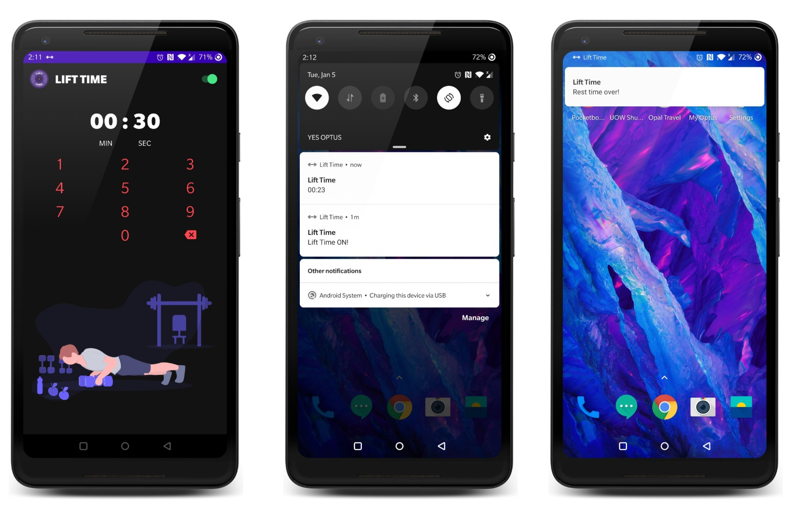

# LiftTime
Use mobile responsibly in between sets at the gym. Time rest periods and prevent distraction. 

 

<h2>How to use LiftTime</h2>

<ul>
<li>Enter your preferred rest time</li>
<li>Switch LiftTime on when at the gym</li>
<li>LiftTime detects the next time you turn on the screen using Broadcastreceiver and starts the rest timer Service</li> 
<li>Notification alert is shown on top of the screen when you reach you rest period to get back to you set</li>
<ul>

